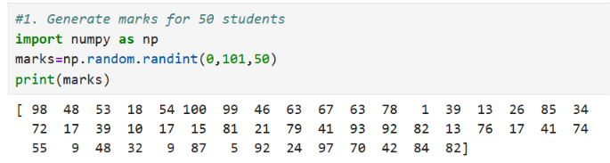
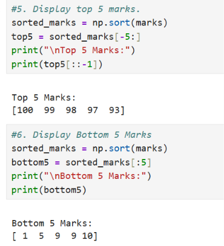
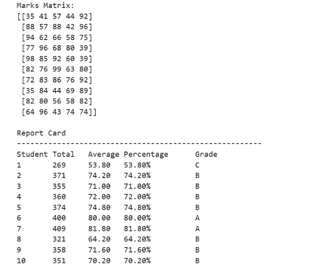

# 📊 Student Marks Analysis Using NumPy


A beginner-friendly Python project that analyzes student marks using **NumPy**. This project performs statistical calculations, grade assignment, subject-wise analysis, and report card generation for students.

---

# 📖 About the Project

This project was developed as a mini project to practice **Python** and **NumPy** concepts.

It generates marks for students, performs statistical analysis, assigns grades, displays top and bottom performers, creates a marks matrix for multiple subjects, identifies subject-wise toppers, and generates a complete report card.

---

# ✨ Features

- 🎲 Generate marks for 50 students
- ➕ Calculate Total Marks
- 📊 Calculate Average Marks
- 🏆 Find Highest Marks
- 📉 Find Lowest Marks
- 📈 Count Students Scoring Above 75
- ❌ Count Students Scoring Below 35
- 📋 Count Students Scoring Between 35 and 75
- 🏅 Assign Grades (A, B, C, D, F)
- 🥇 Display Top 5 Marks
- 📉 Display Bottom 5 Marks
- 📐 Find Median
- 📊 Calculate Standard Deviation
- 📚 Create a 5-Subject Marks Matrix
- 🏆 Find the Topper in Each Subject
- 📄 Generate Report Cards with Total, Average, Percentage and Grade

---

# 🛠 Technologies Used

- Python 3
- NumPy
- Jupyter Notebook

---

# 📂 Project Structure

```text
Student-Marks-Analysis-Using-NumPy/
│
├── Student_Marks_Analysis.ipynb
├── README.md
├── LICENSE
└── images/
    ├── generated_marks.png
    ├── top_bottom.png
    └── report_card.png
```

---

# 📸 Project Screenshots

## 🎲 Generated Marks




---

## 🥇 Top 5 & Bottom 5 Marks




---

## 📄 Student Report Card



---

# 🚀 How to Run

1. Clone or download this repository.
2. Open **Student_Marks_Analysis.ipynb** in Jupyter Notebook.
3. Run all the cells in sequence.
4. View the generated marks, statistics, grades, and report cards.

---

# 📚 Concepts Used

- NumPy Arrays
- Random Number Generation
- Array Indexing & Slicing
- Sorting Arrays
- Statistical Functions
- Matrix Operations
- Conditional Statements
- Loops
- Report Card Generation

---

# 🎯 Learning Outcomes

By completing this project, I learned:

- Working with NumPy arrays
- Performing statistical analysis
- Sorting and filtering data
- Matrix creation and manipulation
- Report generation using Python
- Applying Python concepts to solve real-world problems

---

# 👨‍💻 Author

**Mohit Gaikwad**

GitHub: https://github.com/mohitgaikwad897-tech

---

# ⭐ Support

If you found this project helpful, please consider giving it a ⭐ on GitHub.

Thank you for visiting!
